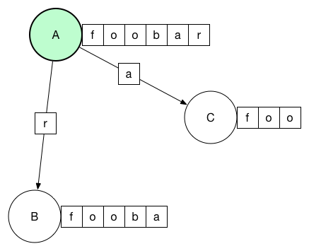

# Distributed Logs

Logs are at the heart of many problems in distributed systems because they solve the problem of ordering changes and distributing data[^1]. They simplify the construction of distributed systems by allowing us to feed multiple processes consistent input, instead of coordinating their responses to inconsistent input. Since logs model a series of consensus problems, there are consensus algorithms that directly model the problem of a distributed log.

Raft such a consensus algorithm. It is designed to be understandable, and does this by decomposing consensus into three subproblems: leader election, log replication, and safety. An algorithm for cluster membership changes is described, but not part of the core consensus protocol. Two optimizations are also suggested: log compaction, and using a binary search to help lagging followers catch up more quickly. These optimizations are important if the application using Raft is long-lived. Without them, the cluster may be unavailable for long periods of time after a node fails.

[^1]: Kreps, Jay. "The Log: What every software engineer should know about real-time data's unifying abstraction." LinkedIn Engineering Blog. Web. 23 Apr. 2016.
