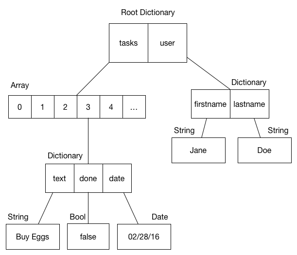

# State Trees

Redux keeps all application state in a tree-like structure. These structures typically have a dictionary at their root, and any combination of dictionaries, arrays, and primitive data types as children. This type of structure is uncommon in Computer Science but common in dynamic languages. Since they resemble a tree, and they are commonly called trees in industry, they will be called trees in this book as well.

State trees have become a popular way to describe the state of user interfaces because of their flexibility. They are able to describe a wide variety user interfaces, from simple list views to interactive infographics. Since Conflux aims to be a general-purpose abstraction for shared memory, state trees are an ideal data structure.
