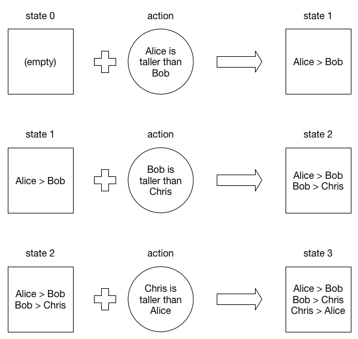
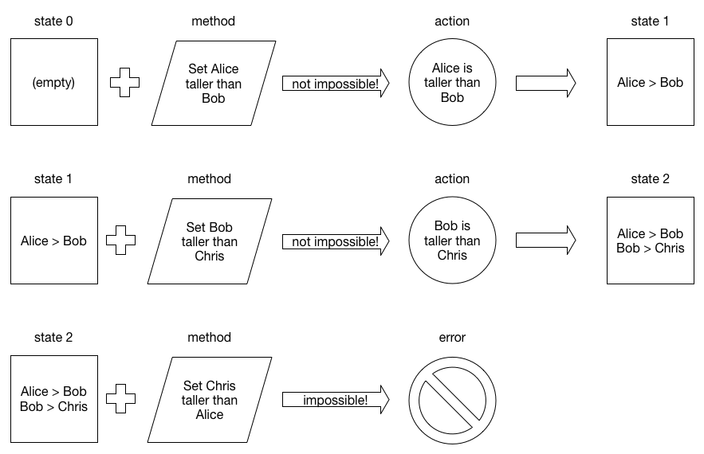

# Why Methods

Immutable state trees are predictable, but not necessarily consistent -- it is possible for an application to enter a state that the programmer never anticipated. This is because the architecture does not specify any rules that restrict *when* an action may be dispatched.

Applications that use immutable state trees typically use the user interface to keep application state consistent. For example, buttons may appear or disappear to reflect available actions. Using the user interface to keep application state consistent is messy, and more importantly, is not possible in applications that do not have a user interface.

