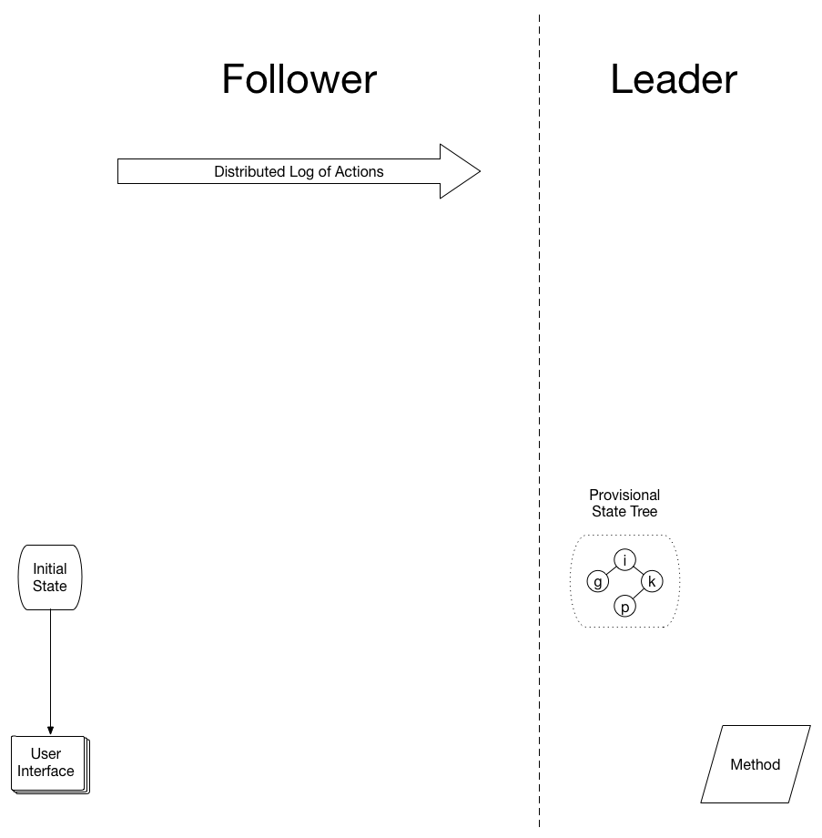
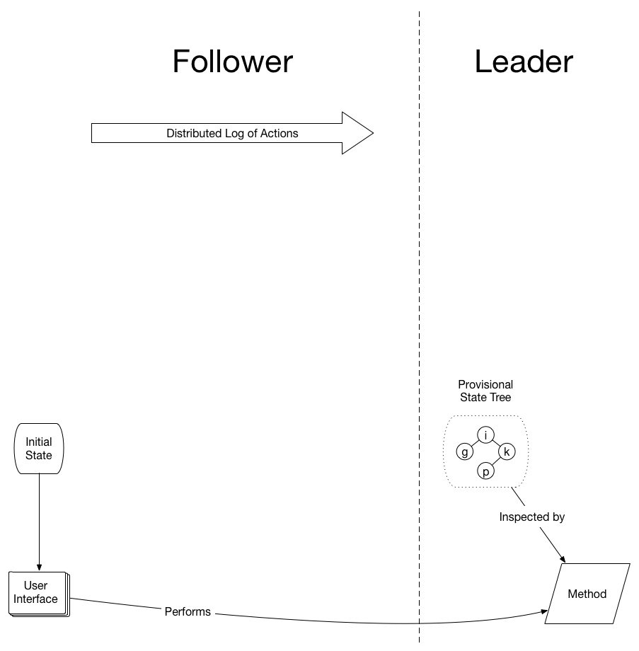
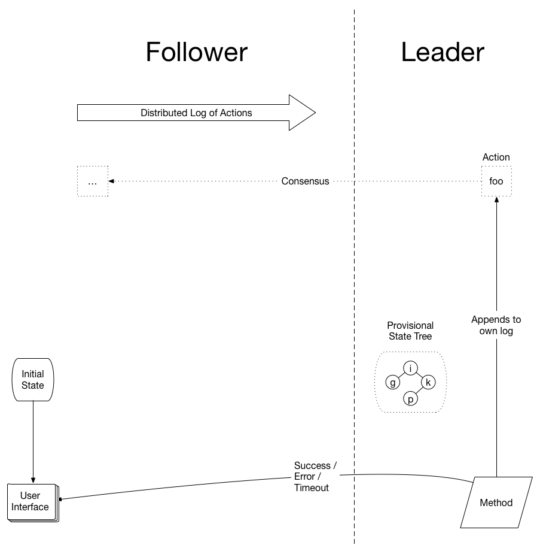
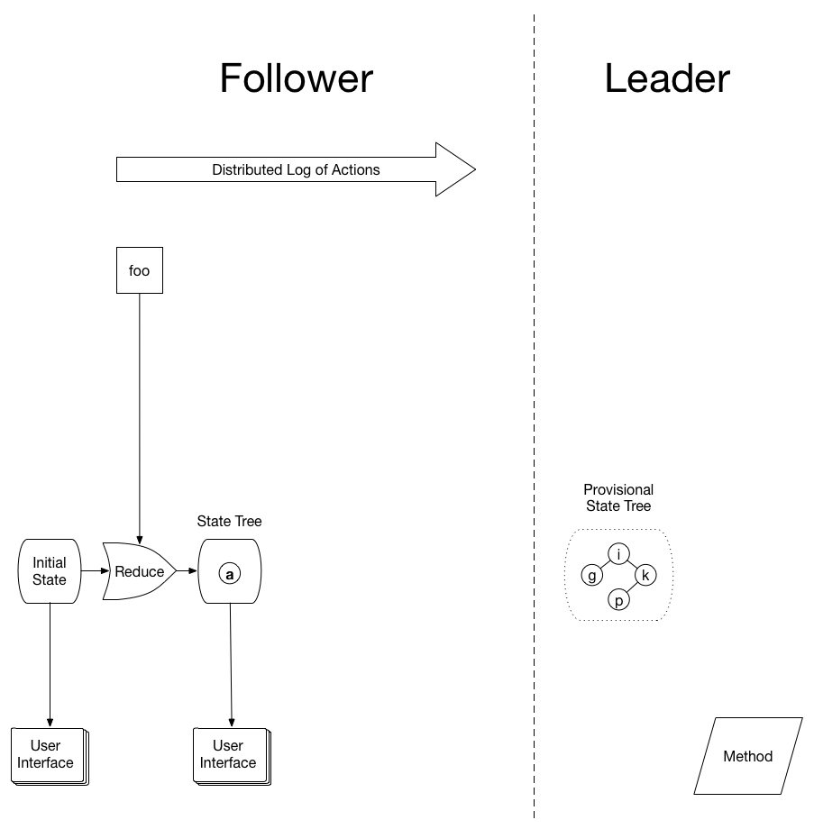
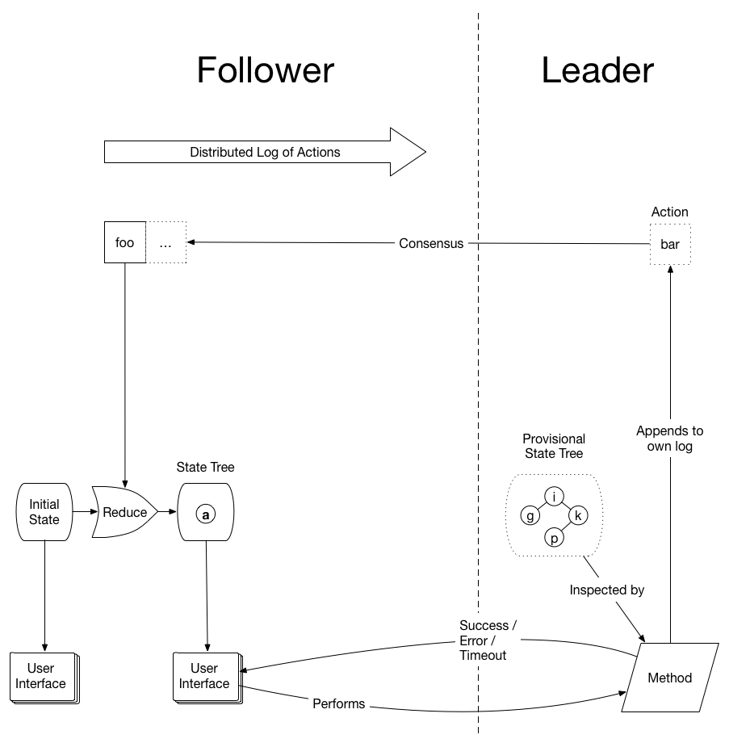

# Walkthrough

The primary idea behind Conflux is that immutable state trees can be implemented using a distributed log. Application development using immutable state trees is fairly well understood, and with a few minor modifications, the same architecture can be used to build distributed applications.

A secondary idea is that declarative user interfaces provide an interesting view into distributed systems, and enable new ways of interacting with them. These interfaces allow us to create interesting applications that blur the line between clients and servers.

A Conflux cluster has one leader and many followers. All nodes start with the same initial state. Nodes have a user interface that is programmatic, visual, or both. The user interface may perform *methods*, which are simply Remote Procedure Calls (RPCs) that are automatically routed to the leader.

Methods are synchronous procedures that inspect the provisional state of the application and *may* emit an action if the transition results in a consistent state. Provisional state is the result of applying the actions in all log entries. This is in contrast to committed state, which is the result of applying the actions in log entries. This is explained in more detail later.

After inspecting provisional state, methods must return one of two values:

* **Error**: if the requested transition would result in an inconsistent state
* **Action**: a data structure describing the transition that the system should make (null actions are acceptable)

The method may also time out, which results in an error value. If the method returns an action, the leader appends the action to its log. The return value of the method is sent back to the node that called the method.

When an action is committed, the node immediately uses its reducer function to produce a new state tree. If the system has a visual interface, the new state tree is used to declare the new user interface.

