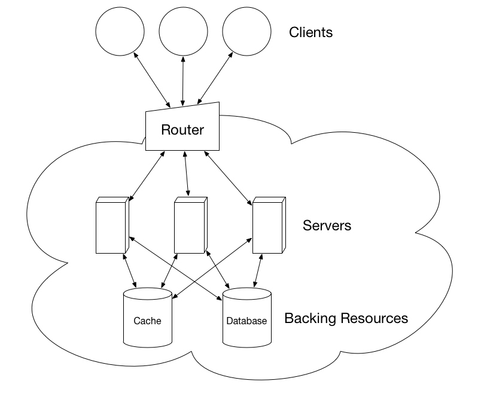

# Introduction

Cloud computing has made it possible to scale an application from one to thousands of servers just by dragging a slider. Since this results in concurrent processes with mutable shared state, care must be taken to avoid non-deterministic behavior. Instead of coordinating these processes, web architectures are usually designed to be as stateless as possible. This is commonly done by implementing a REST[^1] API on top of HTTP, both stateless protocols. The these APIs are then served by stateless processes attached to backing resources such as relational databases and key-value stores.[^2]

An architecture like this makes scaling application servers easy, but it does not solve the problem of shared mutable state. Instead, it pushes that state down into the attached resources. These resources might have consistency models that cause application servers to behave in strange ways. For example, applications that depend on a document-oriented database without transactions might send email notifications with inconsistent information because they cannot get a consistent view of multiple documents at the same moment in time. Another example is how applications that depend on an eventually consistent database may provide different responses for the same request to the same client if those requests are routed to different servers.

Instead of pushing shared mutable state deeper into the stack, this thesis explores pulling some of that state back into the application layer. Distributed shared state is not new, but it has a reputation for being complicated and fragile. Moving state back into the application layer is challenging because few application developers have experience with distributed algorithms. Veteran developers especially know that distributed systems are notoriously difficult to get right.[^3] Therefore, the abstraction we seek must enable a developer without formal training in distributed systems to confidently write predictable distributed applications.

[^1]: Fielding, Roy Thomas. Architectural Styles and the Design of Network-based Software Architectures. Doctoral dissertation, University of California, Irvine, 2000.
[^2]: Wiggins, Adam. The Twelve-Factor App: Processes. Web. 5 Feb. 2016.
[^3]: "Notes on Distributed Systems for Young Bloods." Something Similar. Web. 05 Feb. 2016.
