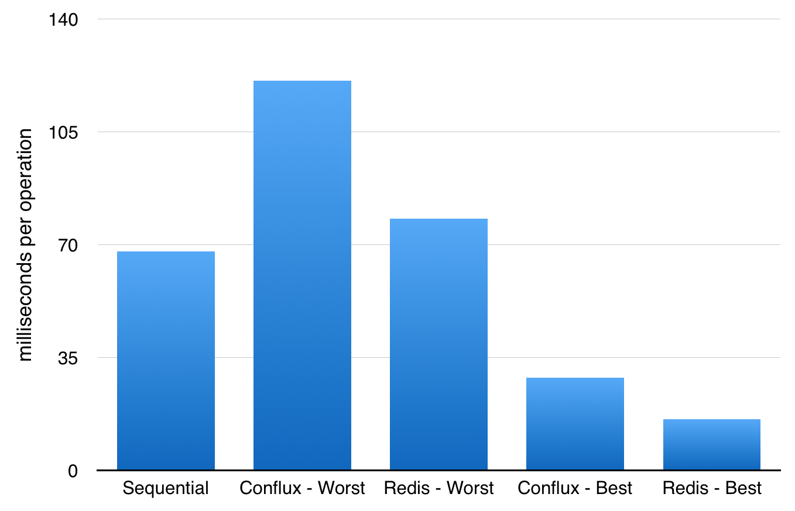

# Performance

To determine if applications built with Conflux run at acceptable speed, we carried out a benchmark on the mutex example. A function that slept for 70 milliseconds was used to simulate a unit of work. That function was then called a hundred times, under different constraints. To create a baseline, the function was called a hundred times in sequence, on a single thread. This set a lower bound of 67.88 milliseconds per operation, which is close to the expected 70 milliseconds.

We then introduced a non-distributed and a distributed mutex. A Redis server was used as a non-distributed mutex, and the Conflux example from an earlier chapter was used as a distributed mutex. Instead of a single thread executing all one hundred tasks, we now used ten threads, each processing ten tasks. The Best Case scenario happens when the processes are each acquiring a unique lock, and never block each other. The Worst Case scenario happens when all ten processes are trying to acquire the same lock.

Scenario             | milliseconds/operation   
-------------------- | ----------------------
Sequential           | 67.88
Conflux - Worst Case | 120.77
Redis - Worst Case   | 78.03
Conflux - Best Case  | 27.72
Redis - Best Case    | 15.80

The results are promising. In the best case scenario, the distributed mutex implemented with Conflux is only 75% slower than the non-distributed mutex. In the worst case scenario, the distributed mutex is 55% slower than the non-distributed mutex. The performance penalty is in the tens of milliseconds, which is an acceptable price to pay for additional fault tolerance in most web applications.

