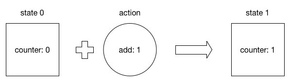
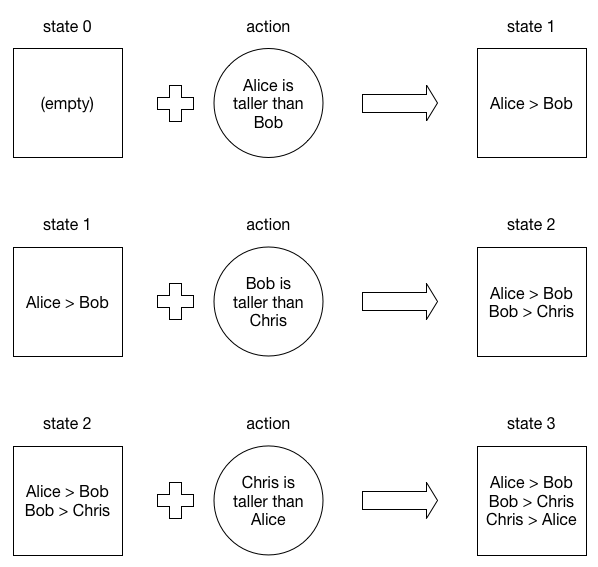
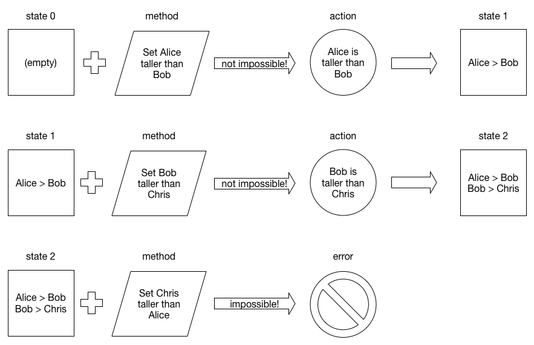

# Methods and Actions

The state trees described in the previous chapter describe application state at some point in time. In order for the application to move to a different state, an *action* has to be dispatched. Actions are data structures that describe the production of one state from another. The data structure chosen for an action is not important; it only needs to contain enough information about the transition to derive the new state. Actions are typically dictionaries with one key describing the type of the action (add, subtract, append, etc), and other keys describing the transition in more detail (add *2*, append *foobar*). This idea is at the core of Redux.

Redux is *internally consistent*, but not necessarily *externally consistent* [^1] -- it is possible for an application using Redux to enter an invalid state that the programmer never anticipated. This is because Redux does not specify any rules that restrict *when* an action may be dispatched. This is acceptable in a synchronous system, but not in an asynchronous one. Since most software has to perform asynchronous network operations, this external inconsistency is a problem that plagues all non-trivial Redux applications.

Conflux improves on Redux by ensuring external consistency through the use of *methods*. Methods are synchronous procedures that inspect the state of the application and dispatch actions only if the transition results in an externally consistent state.

Methods can return one of three values:

* `NULL`, if the system should not change state
* `Error`, if the requested transition would result in an inconsistent state
* `Action`, a data structure describing the transition that the system should make

Redux applications implicitly encode the *idea* of a method in a user interface. For example, buttons may appear or disappear to reflect available transitions. Coupling the user interface with the consistency of the application state is messy, and more importantly, not suitable for applications without a user interface.

Conflux solves this by decomposing transitions into explicit methods and actions. Two steps are necessary because of the asynchronous nature of distributed systems. Methods execute synchronously, but actions are committed asynchronously. Methods decide if a transition is valid given the current state of the system, but the transition is only realized when the system comes to consensus.

[^1]: Hofstadter, Douglas R. Gödel, Escher, Bach: An Eternal Golden Braid. New York: Basic, 1979. Print.
